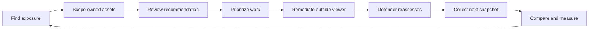
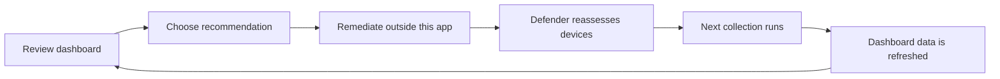
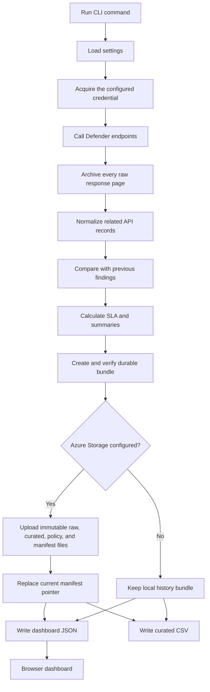
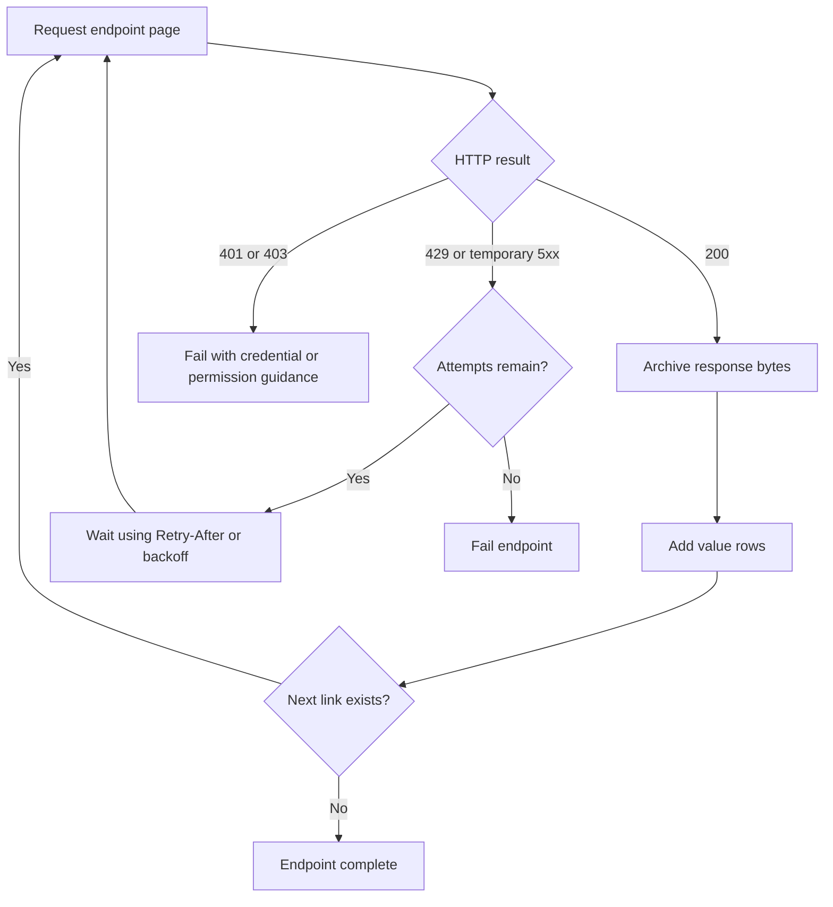
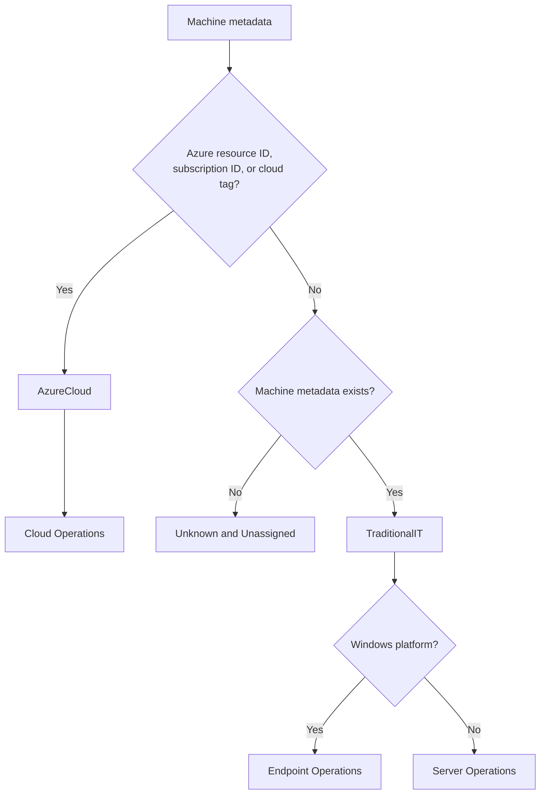
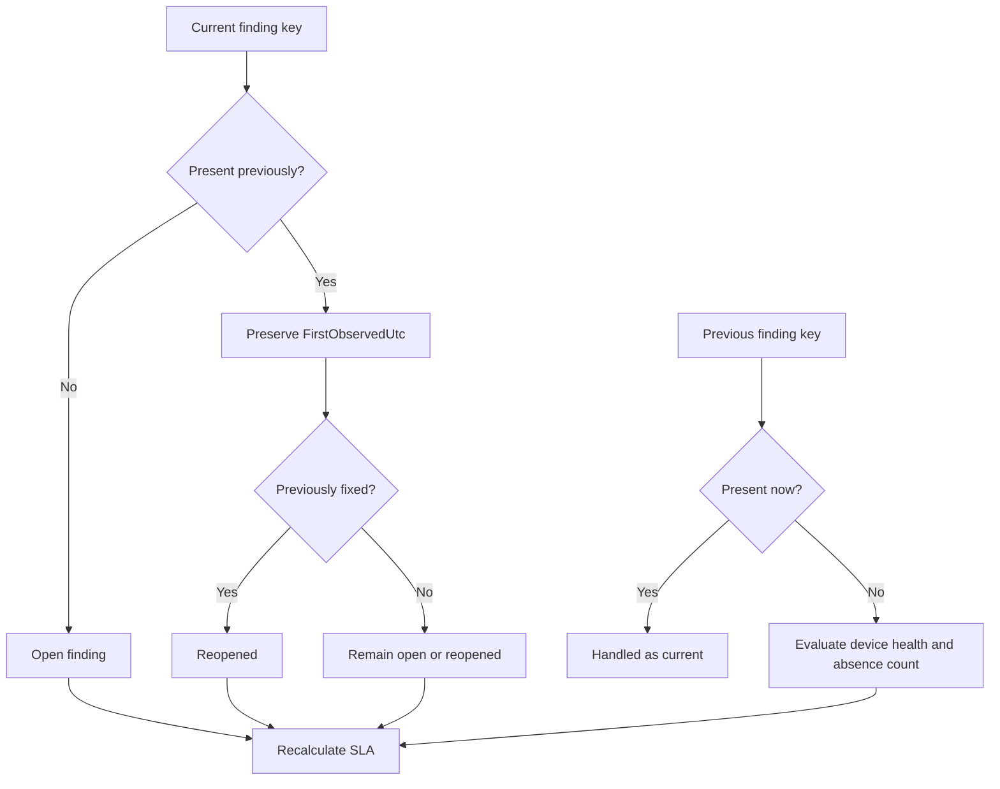
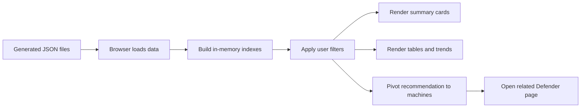

# Data collection and dashboard workflow

> **Author:** Kevin Tigges  
> **Last modified:** 2026-09-27  
> **Purpose:** Explain how Defender observations become retained evidence, lifecycle records, SLA results, and dashboard views.

## Scope

The application collects Microsoft Defender Vulnerability Management data, preserves source evidence, normalizes separate API responses, identifies changes between runs, calculates SLA results, and publishes reporting datasets.

Sections distinguish among:

- **Current behavior:** logic that is implemented in the repository now.
- **Current limitation:** a boundary or consequence of the implementation.

## Purpose and operating gap

Microsoft Defender remains the system that discovers vulnerabilities, assesses devices, produces security recommendations, and reassesses devices after changes are made. This application does not replace those Defender capabilities.

The application adds a focused viewer over that data so daily work can be reviewed without moving among separate Defender pages, flyouts, and filters.

The viewer follows the existing Tenable workflow: identify important work, narrow it to owned assets, review the recommendation, and return after reassessment to see what changed.

The viewer provides:

- Current vulnerability, affected-device, and software inventory.
- Priority ordering with visible severity, exploit, exposure, and asset context.
- Defender recommendations linked to the related findings and devices.
- Ownership pivots for Azure subscriptions and traditional IT assets.
- New, remaining, pending-confirmation, fixed, and reopened lifecycle states.
- SLA status and historical backlog trends.
- Collection health, freshness, completeness, and source evidence.

The application consolidates data that Defender exposes through several related API surfaces. It then normalizes field names and relationships, correlates vulnerabilities with machines and recommendations, uses stable finding keys to compare observations, removes duplicate finding identities from the published result, and creates compact reporting datasets. Original API pages are retained in compressed form so a run can be inspected or replayed without downloading the source data again.

Lifecycle transitions are retained in an append-only finding-event ledger. This preserves repeated fixed and reopened cycles even though the current finding table contains only the latest state.

### Responsibility boundary

Defender and this application have different responsibilities.

| Defender remains responsible for | This application is responsible for |
|---|---|
| Discovering vulnerabilities and exposed devices | Collecting the available Defender observations on a schedule |
| Producing recommendation and risk information | Joining separate API datasets into one reporting model |
| Continuously assessing device and software state | Preserving snapshots so changes can be compared over time |
| Reassessing devices after remediation | Presenting new, remaining, fixed, and reopened outcomes |
| Providing the source recommendation and remediation context | Making priority and SLA logic explicit and filterable |
| Maintaining the authoritative security telemetry | Providing subscription, asset-class, team, and device pivots |

This boundary keeps the Defender integration one-way and read-only. The
application does not send telemetry, status, decisions, or changes back to
Defender. Users perform patching, configuration, exception, and remediation
work through the appropriate operational tools. The viewer records what
Defender reports on each collection and uses those snapshots to show activity
over time.

### Snapshot rationale

A current Defender response shows the present state but does not provide the
retained activity timeline used by this workflow. Snapshot collection creates
the evidence needed to distinguish:

- A newly observed finding
- A finding that remained open
- A finding that disappeared
- A previously disappeared finding that returned
- Growth or reduction in the backlog
- SLA performance over time
- Collection failure versus a true absence of findings

The raw snapshot is retained first, before transformation. This protects the source evidence and allows normalization to be replayed when application logic changes.

### Normalization rationale

The Defender APIs return different parts of the operating picture from different endpoints. A machine-vulnerability row identifies an affected machine, CVE, product, and version, but the dashboard also needs machine ownership evidence, Azure subscription information, exploit context, recommendation details, and remediation context.

Normalization combines those records into consistent datasets so every dashboard view uses the same definitions. Without that step, each page would have to independently interpret raw API fields and could produce conflicting counts.

### Deduplication and correlation

The same vulnerability can appear across many devices, software versions, recommendations, and collection runs. The application keeps the detailed device-level finding instances, while also building indexes and summaries that let the viewer show:

- One device-level finding without accidental duplicate keys
- One CVE watchlist row with the number of affected devices
- One recommendation linked to all matching findings and machines
- One subscription or ownership total derived from the same underlying findings
- One lifecycle history for each finding key across snapshots

Current validation rejects duplicate `FindingKey` values in the published findings dataset. The dashboard also groups repeated CVEs and recommendations for presentation rather than treating every source row as a separate top-level work item.

### Workflow

The viewer turns collected telemetry into an ordered decision path:

1. **Find:** See open vulnerabilities, critical/high findings, affected devices, and known-exploit evidence.
2. **Scope:** Limit the view to an Azure subscription, cloud assets, traditional IT assets, or an operating team.
3. **Recommend:** Group device-level findings under the Defender recommendation that describes the action to take.
4. **Prioritize:** Sort by an explainable score using severity, CVSS, exploit evidence, internet exposure, device exposure, and asset criticality.
5. **Remediate:** Follow the Defender recommendation and complete the change outside this application.
6. **Verify:** Compare the next collected snapshot with the prior observation to see what remained, disappeared, or returned.
7. **Measure:** Use SLA and historical summaries to report timeliness, backlog direction, new findings, fixed findings, and repeated findings.



### Current implementation

The repository implements live and synthetic collection, raw page archives,
replay, normalization, finding-key validation, current-versus-previous
reconciliation, SLA calculations, recommendation and machine pivots,
historical summaries, CSV/JSON exports, scheduled Function collection, an
authenticated Web App, and optional shared recommendation tracking.

## Current user workflow

The user workflow is intentionally simple:

1. Open the dashboard.
2. Scope the data to the user's Azure subscriptions or traditional IT assets.
3. Review vulnerabilities and recommendations.
4. Optionally mark a live recommendation **In progress**.
5. Perform remediation outside this application and mark the recommendation
   **Fixed** when it is ready for validation.
6. Wait for Defender to reassess the affected devices.
7. Run the next collection and inspect the confirmed or still-detected result.

The application does not assign remediation tasks, apply patches, or change
Defender records. Shared recommendation status is display-only application
state and does not affect finding lifecycle or SLA calculations.



## Main components

| Component | Current responsibility |
|---|---|
| `vulnerability-view` CLI | Runs preflight, live collection, synthetic builds, validation, and exports. |
| Azure Function | Runs the complete `collect-live` CLI path daily, including reconciliation, durable bundle creation, ADLS upload, summaries, and current output publication. |
| Defender API client | Authenticates, downloads paginated endpoint data, retries temporary failures, and archives every downloaded page. |
| Normalizer | Joins related Defender responses and converts them into consistent dashboard records. |
| Reconciliation logic | Compares the latest findings with prior observations to infer fixed and reopened findings. |
| Export writer | Writes curated CSV files and dashboard JSON files. |
| ADLS Gen2 | Stores immutable raw pages, curated snapshots, SLA policy, and run manifests when configured. |
| Dashboard Web App | Reads the verified current bundle, serves the browser, enforces Easy Auth identity, and optionally stores shared recommendation workflow events. |

## End-to-end data flow

The complete workflow currently exists in the CLI path. The Azure Function path is smaller and is described separately later.



## Workflow information derived from collected data

The collection is not simply a copy of one Defender table. Each useful dashboard result is assembled from several observations or from a comparison with an earlier run.

| Collected signal | What the application does with it | What the user sees | Why it matters |
|---|---|---|---|
| Machine vulnerability | Creates the detailed device, CVE, product, and version finding | Vulnerable device rows and affected-software details | Establishes the specific instance that needs attention |
| Machine inventory | Adds device name, operating system, exposure, risk, tags, Azure metadata, and last-seen context | Device pivots, cloud/local classification, subscription filters | Connects technical exposure to an owned asset scope |
| Vulnerability knowledge | Adds CVSS, severity, publication/detection details, and exploit evidence | Severity and known-exploit views | Explains the technical urgency of the vulnerability |
| Security recommendation | Links findings to Defender's recommended corrective action | Recommendation workbench and Defender handoff | Converts a list of CVEs into actionable work |
| Recommendation-machine relationship | Identifies the devices Defender associates with a recommendation | Affected-machine pivot | Shows the expected reach and impact of the recommended action |
| Remediation activity, when available | Adds task state, due date, targets, and completion information | Remediation progress views | Separates requested work from Defender-confirmed exposure changes |
| Secure Score, when authorized | Converts the latest score into an executive posture summary | Secure Score cards | Provides broader security posture context without changing finding priority |
| Previous finding snapshot | Compares finding keys with the current snapshot | New, remaining, fixed, and reopened results | Supplies the change history that a current-only response cannot provide |
| SLA policy | Applies the selected time allowance to first-seen and fixed dates | Within-SLA and outside-SLA outcomes | Measures whether exposure is being reduced within the expected period |
| Collection-run status | Records endpoint success, row count, duration, and errors | Freshness timestamp and health state | Prevents a missing or failed refresh from looking like a clean environment |

### Detailed findings versus consolidated work

The application intentionally keeps two levels of information:

- **Finding level:** one affected device, CVE, product, and version combination. This level supports evidence, SLA clocks, device drill-through, and exact comparison between snapshots.
- **Work level:** grouped CVEs, recommendations, subscriptions, asset classes, teams, and trends. This level supports prioritization and day-to-day decisions without forcing users to review thousands of nearly identical rows.

The detailed records are not discarded when the viewer consolidates them. Summary cards and recommendation pivots are calculated from those records, so users can move from a high-level count back to the affected devices.

### Compressed source evidence versus curated reporting data

The application keeps two representations because they solve different problems:

- **Compressed raw pages** preserve the response exactly as received. They are suitable for replay, investigation, and long-term evidence, but they are not convenient dashboard records.
- **Curated datasets** contain normalized columns, relationships, lifecycle fields, priority, and SLA results. They are suitable for filtering and reporting, but they can always be rebuilt from retained raw pages when transformation logic changes.

This separation lets the viewer evolve without losing the original telemetry that produced an earlier report.

## Configuration loading

Settings are represented by the `Settings` class in `src/vulnerability_view/config.py`.

The CLI calls:

```text
Settings.load(Path("config/vulnerability-view.json"))
```

The load order is:

1. Load `.env` when it exists.
2. Read `config/vulnerability-view.json` when that file exists.
3. Let process environment variables override file values.
4. Apply built-in defaults for values that are still missing.

The Azure Function calls `Settings.load()` without a JSON configuration path. In that path, it uses `.env` locally or application settings in Azure.

Supported data modes are:

- `synthetic`: generated sample data only
- `live`: current data collected from Defender
- `combined`: synthetic history plus current live data

If `live` or `combined` is requested but live settings are incomplete, configuration falls back to `synthetic`.

The current `live_configured` check requires a tenant ID and a Defender API base URL. Local runs use developer credentials through `DefaultAzureCredential`; Azure-hosted runs use `ManagedIdentityCredential`.

## Commands and what they do

### `vulnerability-view preflight`

Preflight checks whether credentials and permissions can reach the configured API surfaces.

It performs a small request against each Defender endpoint, normally requesting one row. It also makes the optional Microsoft Graph Secure Score request.

The command exits with an error only when a required endpoint fails. Optional endpoint failures are reported but do not fail preflight.

### `vulnerability-view collect-live`

This is the direct live refresh command. It:

1. Reads existing dashboard outputs for history.
2. Downloads a new Defender snapshot, or replays a raw snapshot when `--from-raw` is used.
3. Normalizes the responses.
4. Finds previous live findings.
5. Reconciles current and previous findings.
6. Builds the daily summary.
7. Creates collection-run status records.
8. Rewrites the live dashboard and CSV outputs.
9. Uploads the current raw run to ADLS when storage is configured.

This command writes live data only. It does not preserve synthetic rows in the exported dashboard files.

### `vulnerability-view build-sample --mode synthetic`

This command creates deterministic sample data from the configured seed and history length. It calculates summaries and reconciliation, then writes all dashboard and CSV outputs.

It does not call Defender.

### `vulnerability-view build-sample --mode live`

The build begins with synthetic data, attempts a live collection, and replaces the synthetic data with live data when collection succeeds.

If live collection fails, the synthetic output is retained and the failure is recorded as a warning in the run summary.

### `vulnerability-view build-sample --mode combined`

The build creates synthetic history and then appends the collected live datasets. Every row contains `DataOrigin`, which lets the dashboard separate live and synthetic data.

### `vulnerability-view validate`

Validation does not call Defender. It checks the files that already exist locally.

Current checks include:

- Required curated CSV and dashboard JSON files exist.
- `FindingKey` values are unique.
- `DataOrigin` is either `Live` or `Synthetic`.
- Reconciliation rows satisfy:

$$
CurrentRemaining = PreviousRemaining + New - Fixed + Reopened
$$

## Defender and Graph data sources

The Defender client is defined in `src/vulnerability_view/defender_client.py`.

### Required Defender endpoints

| Dataset | API purpose | Required permission |
|---|---|---|
| Machine vulnerabilities | Vulnerabilities affecting each machine and software version | `Vulnerability.Read.All` |
| Machines | Device identity, platform, health, tags, risk, exposure, and last-seen information | `Machine.Read.All` |
| Vulnerabilities | CVE details, severity, CVSS, exploit evidence, and detection metadata | `Vulnerability.Read.All` |
| Recommendations | Defender security recommendations and exposed-machine counts | `SecurityRecommendation.Read.All` |

A failure from any required endpoint stops the collection.

### Optional Defender endpoints

The collector also probes remediation tasks and vulnerability changes. These routes were not found in the current public API documentation when the sample was built, so their failure does not stop collection.

After collecting recommendations, the application derives vulnerability recommendation memberships from the machine-vulnerability feed. In daily `targeted` mode, it requests machine references only for non-vulnerability recommendations. `full` mode requests every exposed recommendation, and `auto` uses targeted mode daily with a configurable weekly full reconciliation. Individual recommendation-machine failures are recorded as a partial success instead of failing the whole run.

### Microsoft Graph Secure Score

The collector calls Microsoft Graph for the latest Secure Score using `SecurityEvents.Read.All`.

Secure Score is optional. A 401, 403, or other Graph failure produces an `OptionalUnavailable` status and collection continues without score rows.

Current Graph use is limited to Secure Score. The application does not currently use Graph advanced hunting as its primary vulnerability source.

## Authentication behavior

Normal local collection uses `DefaultAzureCredential` with interactive browser, environment client-secret, workload identity, and managed identity credentials disabled. Explicit `AUTH_MODE=client_secret` is a separately guarded local-development option and is rejected on Azure hosts.

Supported credential sources are:

- A previously authenticated developer credential, such as Azure CLI, during local development
- `ManagedIdentityCredential` when deployed in Azure

Defender tokens use the `https://api.securitycenter.microsoft.com/.default` scope even though requests are sent to `https://api.security.microsoft.com`.

Graph Secure Score uses the `https://graph.microsoft.com/.default` scope.

## Download, pagination, and retry logic

Every endpoint is downloaded one page at a time. The client follows `@odata.nextLink` until no next page remains.

For each successful page:

1. The original response bytes are archived.
2. The JSON `value` rows are added to the endpoint result.
3. The next-link URL is requested.

Requests use separate connection and response timeouts. HTTP 429 and temporary server failures (`500`, `502`, `503`, and `504`) are retried up to five attempts.

Retry delay uses the service's `Retry-After` header when available. Otherwise, it uses bounded exponential backoff with a small random delay.

HTTP 401 and 403 errors fail immediately with an authentication or permission message.

Progress output reports cumulative rows and elapsed time. When Defender supplies `@odata.count`, it also reports a percentage. Recommendation-machine enrichment reports overall recommendations completed instead of logging each one-page request separately.



## Raw data retention

Raw API pages are written before normalization so the original source responses can be inspected or replayed.

### Local layout

Each live run receives an ID in this form:

```text
live-YYYYMMDDTHHMMSSZ
```

Pages are stored as gzip-compressed JSON:

```text
output/raw/<run-id>/<endpoint>-page-0001.json.gz
```

Recommendation-machine filenames include the recommendation ID. Secure Score is archived as its own page when Graph collection succeeds.

### ADLS layout

When a storage account is configured, local gzip pages are uploaded to ADLS Gen2 using this hierarchy:

```text
raw/YYYY/MM/DD/<run-id>/<page-name>.json.gz
```

Uploads use `overwrite=False`. If the same path already exists, HTTP 409 is accepted and the file is treated as already archived. This makes raw-page uploads idempotent by path.

### Raw replay

`collect-live --from-raw` and `build-sample --from-raw` reconstruct endpoint payloads from an archived run without calling Defender.

Replay requires raw pages for all required endpoints. Missing optional pages are reported as unavailable. The replayed data then passes through the same normalization logic as a new collection.

## Normalization

Normalization is implemented in `normalize_live()` in `src/vulnerability_view/live_collector.py`.

The API responses are first indexed for efficient joins:

- Machines by machine ID
- Vulnerabilities by uppercase CVE ID
- Recommendations by recommendation ID
- Vulnerability recommendations by product name
- Remediation tasks by recommendation reference

The machine-vulnerability rows drive finding creation. Each source row is enriched with machine, CVE, recommendation, SLA, classification, and priority information.

### Asset classification

The current rules are evaluated in this order:

1. If Azure resource metadata, a subscription ID, or a recognized cloud tag exists, classify the device as `AzureCloud` and assign `Cloud Operations`.
2. Otherwise, if machine metadata exists, classify it as `TraditionalIT`.
3. Traditional Windows assets are assigned to `Endpoint Operations`; other platforms are assigned to `Server Operations`.
4. If no matching machine metadata exists, classify it as `Unknown` and assign `Unassigned`.

Recognized cloud tags are currently hardcoded as `azure`, `azurecloud`, and `cloud-owned`.

Subscription ID is read directly from machine metadata when possible. If it is absent, the code attempts to extract it from the Azure resource ID.

Every finding includes `ClassificationReason` to explain why the classification was chosen.



### Finding identity

`FindingKey` uses the Defender machine-vulnerability row ID when present.

If Defender does not provide an ID, the fallback is a SHA-256 hash of:

```text
machineId | cveId | productName | productVersion
```

This key is used to match findings between snapshots.

**Current limitation:** The native and fallback identities include software version. A version change can close one finding key and create another even when the same device and CVE remain part of one remediation story.

### Initial live finding state

Every finding produced directly by normalization begins with:

- `FindingStatus = Open`
- Empty `FixedUtc`
- Empty `ReopenedUtc`
- Empty assignment and ticket fields
- `AssignmentStatus = NotAssigned`

Lifecycle fields are then updated by reconciliation.

## Priority scoring

The custom priority score is calculated in `src/vulnerability_view/normalizer.py`. It is not a native Defender score.

The score combines:

- Severity
- CVSS score
- Verified or public exploit evidence
- Internet-facing status
- Device exposure level
- Asset criticality

The result is capped at 100. `PriorityExplanation` stores the point calculation so users can see why one finding ranks above another.

## SLA calculation

SLA policies are loaded from `config/sla-policies.json`.

The current policies select a target based on severity and known-exploit evidence. When more than one policy matches, the shortest SLA is selected.

The due time is:

$$
SlaDueUtc = FirstObservedUtc + SlaDays
$$

Possible SLA states are:

- `OpenWithinSla`
- `OpenOutsideSla`
- `FixedWithinSla`
- `FixedOutsideSla`
- `Unknown`

`Unknown` is used when a reliable first-seen date or matching policy is unavailable.

Live SLA starts at the first snapshot in which this collector observes the device-level finding. Defender's CVE `firstDetected` value is retained separately as source metadata. The policy is versioned and stored with each durable run, but the current values remain sample settings rather than approved operating policy.

## Finding lifecycle and reconciliation

Reconciliation compares the current finding keys with previous live finding keys.

Previous findings are assembled from:

- Older live rows retained in current dashboard outputs
- The most recent earlier raw `live-*` run, replayed through normalization

Current behavior is:

1. A finding present in both snapshots keeps its earlier `FirstObservedUtc`.
2. A previously fixed finding that appears again becomes `Reopened` and receives `ReopenedUtc`.
3. A first qualified absence becomes `PendingConfirmation`.
4. A second consecutive qualified absence while the device is active and fresh becomes `Fixed`.
5. Stale, offboarded, or missing device evidence becomes `StaleDevice`, `OutOfScope`, or `Unknown` instead of fixed.
6. SLA is recalculated after lifecycle changes.



### Meaning of fixed today

Under the current code, **fixed means the exact finding key was absent from two consecutive complete snapshots while the device remained active and had reported within 48 hours**.

The first qualified absence is `PendingConfirmation`. Stale, offboarded, unsupported, or missing inventory evidence is reported separately. Defender remediation-task completion is supporting context but does not directly set finding status.

## Daily summaries and trends

Daily summaries are calculated from finding lifecycle timestamps rather than stored as independent source events.

Findings are grouped by:

- Asset class
- Subscription ID
- Owner team
- Severity
- Data origin

For each day in the reporting window, the application derives:

- New findings
- Fixed findings
- Remaining findings
- Known-exploit backlog
- SLA outcome counts
- Assignment status counts
- Median days to fix

Monthly reconciliation calculates:

$$
CurrentRemaining = PreviousRemaining + New - Fixed + Reopened
$$

The validation command checks this relationship in exported reconciliation rows.

## Curated output files

`write_outputs()` rewrites current CSV exports for every dataset and dashboard JSON for every dataset except the full vulnerability inventory:

```text
output/curated/<dataset>.csv
dashboard/data/<dataset>.json
dashboard/data/cve-details/<cve-id>.json
```

The vulnerability inventory can be large, so only CVEs referenced by current findings are written as individual dashboard detail files. Empty datasets clear stale current data.

Supported dataset names are:

- `findings`
- `finding-events`
- `devices`
- `vulnerabilities`
- `recommendations`
- `recommendation-machines`
- `remediation-activities`
- `daily-summary`
- `collection-runs`
- `reconciliation`
- `secure-scores`

Files are rewritten rather than appended. Historical behavior is preserved inside the rows assembled by the current build, not by appending to the same CSV or JSON file.

## Dashboard behavior

The dashboard remains static HTML, CSS, and JavaScript, but it loads datasets through same-origin `/api/data/*` routes. The FastAPI server reads generated files from `dashboard/data` in local mode or follows and verifies the Azure current manifest in Azure mode.

Required datasets are findings, recommendations, remediation activities, daily summary, and collection runs. Secure Score and recommendation-machine data are optional.

The browser creates in-memory indexes connecting:

- Recommendations to findings
- Recommendations to machines
- Recommendation IDs to recommendation records
- CVEs to exploit evidence

Filters are applied in the browser. Current filters include:

- Data origin
- Severity
- Recommendation type
- Asset classification
- Subscription
- Derived owner team
- Search text
- Asset domain

The seven dashboard views are:

1. Find
2. Workstations
3. Recommendations
4. Prioritize
5. Remediate
6. Trend
7. Ownership

The dashboard also provides pivots from recommendations to affected machines and links back to Defender for live records.

When recommendation tracking is enabled, the Recommendations view adds a
shared status filter and actions for live recommendations. **Marked fixed**
remains **Awaiting next collection** during the same run. On a newer complete
run it becomes **Confirmed** when no active live findings remain, or **Still
detected** when findings remain. The default **Needs attention** filter hides
awaiting and confirmed recommendations. Synthetic recommendations are
read-only, and tracking never changes the SLA or finding datasets.

Collection-run records provide the displayed snapshot timestamp and health indicator.



### Current access model

Local dashboard authentication is disabled by default through
`DASHBOARD_AUTH_ENABLED=false`; subscription and asset-class controls remain
convenience filters rather than security boundaries. The FastAPI server has a
default-off App Service authentication enforcement layer. The deployed Web App
enables both App Service Authentication and `DASHBOARD_AUTH_ENABLED=true`, so
every static page and `/api/*` request requires the trusted
`X-MS-CLIENT-PRINCIPAL` identity supplied by App Service. The flag cannot be
enabled on a local host and does not provision Entra resources.

## Azure Function behavior

`function_app.py` defines a timer trigger scheduled for 05:00 UTC each day.

The Function calls the same `collect-live` command path used manually. It:

1. Loads existing current findings from ADLS when storage is configured.
2. Collects and locally archives Defender and Graph pages.
3. Normalizes and reconciles findings.
4. Builds daily summary, live reconciliation, and collection-run records.
5. Creates a local history bundle containing all curated datasets and the SLA policy.
6. Uploads immutable raw, curated, policy, and manifest files to ADLS.
7. Replaces `current/manifest.json` only after immutable upload completes.
8. Writes current dashboard and CSV outputs.

An upload or collection failure raises an error before current outputs are replaced.

### Scale-oriented Function design

The local `simulate-scheduled-run` command exercises the same collection, lifecycle, bundle, and publication path without requiring a deployed Function:

```text
vulnerability-view simulate-scheduled-run --from-raw latest --local-only
vulnerability-view simulate-scheduled-run --from-raw latest
vulnerability-view simulate-scheduled-run --enrichment targeted
```

The first command is fully offline. The second replays local source pages and tests Azure Blob upload. The third performs a new targeted Defender collection and durable upload.

For a larger environment, the Azure-hosted implementation should split the same logic into Durable Function activities:

1. Collect required core endpoints.
2. Derive vulnerability recommendation-machine relationships.
3. Collect non-vulnerability enrichment in bounded batches.
4. Normalize and reconcile from durable source pages.
5. Build summaries, lifecycle events, and the run bundle.
6. Verify hashes and replace the current manifest last.

Use Flex Consumption on-demand with zero always-ready instances and the regular Azure Storage Durable provider. This preserves scale-to-zero billing and avoids the separately priced managed Durable Task Scheduler. The browser never starts this workflow; it reads only completed published data.

## Failure behavior

| Situation | Current result |
|---|---|
| Required Defender endpoint fails | Collection raises an error and stops. |
| Optional Defender endpoint fails | Collection continues and records `OptionalUnavailable`. |
| Some recommendation-machine calls fail | Collection continues with `PartialSuccess`. |
| Secure Score fails | Collection continues without Secure Score rows. |
| ADLS upload fails in the CLI | A warning is printed and local raw files are retained. |
| Live portion of `build-sample` fails | Synthetic output is retained and a warning is written to the run summary. |
| Direct `collect-live` fails | The command exits with the collection error; it does not replace outputs successfully. |
| Required raw replay pages are missing | Replay stops with an error. |

## Current storage roles

The three storage forms serve different purposes:

| Storage | Purpose |
|---|---|
| Dashboard JSON and curated CSV | Current presentation and portable exports |
| ADLS raw pages | Original evidence and replay |
| ADLS curated snapshots and run manifests | Lifecycle history, SLA reporting, integrity checks, and audit |

## Code map

| Responsibility | File |
|---|---|
| CLI command orchestration | `src/vulnerability_view/dataprep_cli.py` |
| Azure Function timer | `function_app.py` |
| Configuration | `src/vulnerability_view/config.py` |
| Defender HTTP client | `src/vulnerability_view/defender_client.py` |
| Collection, normalization, and reconciliation | `src/vulnerability_view/live_collector.py` |
| Secure Score collection | `src/vulnerability_view/secure_score_client.py` |
| Data models | `src/vulnerability_view/models.py` |
| SLA and priority | `src/vulnerability_view/normalizer.py` |
| Daily and monthly summaries | `src/vulnerability_view/summary_builder.py` |
| Synthetic sample data | `src/vulnerability_view/synthetic_generator.py` |
| CSV and JSON exports | `src/vulnerability_view/export_writer.py` |
| Raw local and ADLS storage | `src/vulnerability_view/storage_writer.py` |
| Dashboard application | `dashboard/index.html`, `dashboard/app.js`, `dashboard/styles.css` |
| Dashboard API and user-auth enforcement | `src/vulnerability_view/dashboard_server.py` |
| SLA policy configuration | `config/sla-policies.json` |

## Document maintenance checklist

When collection or dashboard behavior changes:

1. Update the affected behavior description.
2. Update any Mermaid diagram that shows the changed path.
3. Update the command descriptions if arguments or side effects changed.
4. Update the current limitations when a limitation is fixed or a new one is introduced.
5. Verify the document against tests and the owning functions before merging the change.
