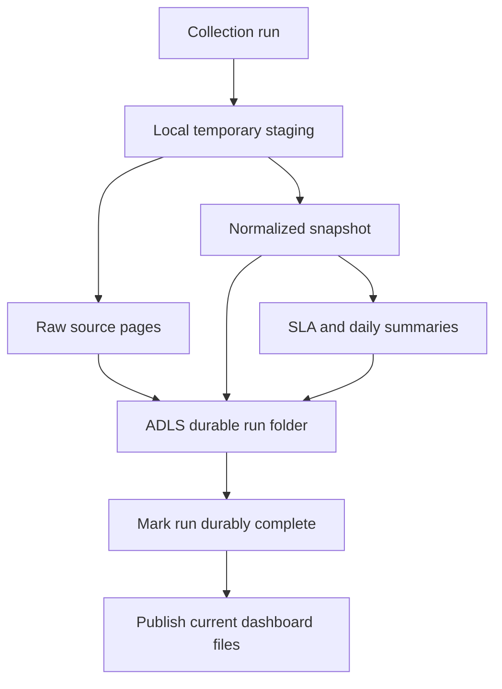
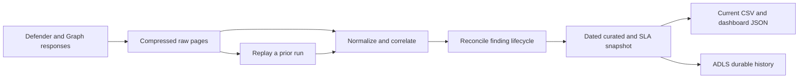
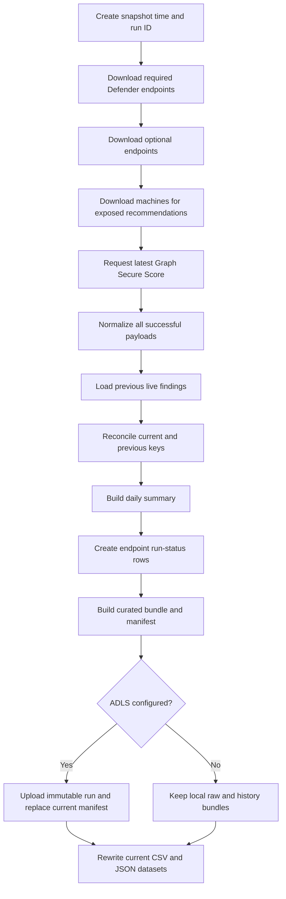
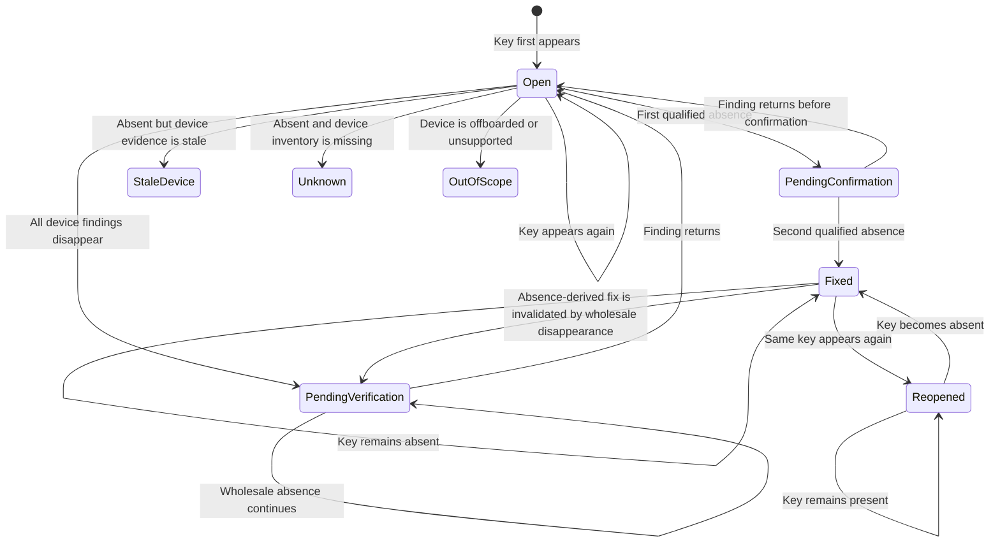
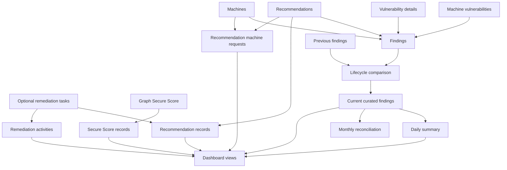

# Data structure, collection runs, and history

> **Last modified:** 2026-09-27
> **Purpose:** Define collected data, run processing, retention, change detection, and SLA calculations.

## Collection flow

1. Download current Defender records and retain each original response page as compressed source evidence.
2. Join related records, compare finding keys with the previous run, and calculate lifecycle and SLA results.
3. Create a versioned history bundle and, when configured, upload it to immutable ADLS paths before advancing the current manifest.
4. Rewrite the local JSON and curated CSV presentation files used by the dashboard and validation tools.

## Durable retention requirement

Historical vulnerability and SLA data must not depend on the local filesystem of an application or Function instance.

### No-delete rule

The application never deletes retained Azure Storage data. Paths under `raw/`, `curated/`, and `runs/` are append-only. A request to start over, reset, rebuild, clean up, or redeploy creates a new run; it does not remove prior history. Only `current/manifest.json` is replaceable.

The storage account must be preserved separately when application infrastructure is replaced. No lifecycle deletion policy should be added for retained history without explicit approval for the exact data and retention change.

The `dvm-history` container uses an unlocked 365-day time-based immutability
policy. During that period Azure prevents changes and deletion of retained
blobs. The policy remains unlocked while the workflow is validated; locking it
later is an explicit irreversible operation because a locked policy cannot be
removed or shortened. The `dvm-current` container is excluded so
`current/manifest.json` can be replaced after a completed run.

Blob and container soft delete are separately configured for 30 days. Soft
delete is a recovery window after an eligible deletion, whereas WORM prevents
the deletion during retention. Soft delete never deletes active data, but the
retained deleted copy expires after 30 days. WORM expiration does not delete
history.

Local instance storage can be lost or become inconsistent when:

- The application is redeployed
- The hosting platform replaces or restarts an instance
- The application scales to more than one instance
- A new version starts with a clean filesystem
- Temporary storage is reclaimed
- A cleanup process removes local output

Multiple application instances also do not provide one shared, ordered history. One instance might contain files that another instance cannot see.

ADLS Gen2 is the required durable store for retained history. **ADLS means Azure Data Lake Storage Gen2.** It is built on Azure Blob Storage and adds a hierarchical directory structure suitable for organizing dated runs and analytical datasets.

The intended storage rule is:

> A collection run is not durably complete until its run manifest, raw source pages, normalized snapshots, and SLA/history outputs are stored in ADLS.

Local files remain useful for download staging, development, replay caches, and serving the current dashboard, but they are not the authoritative historical record.

The durable bundle is implemented for live CLI and scheduled Function runs when Azure Storage is configured. Raw files are written locally first, then the application uploads raw pages, every curated dataset, the SLA policy, and an immutable run manifest. The current manifest pointer is replaced last.

When Azure Storage is not configured, the same bundle is staged under `output/history/<run-id>`, but it remains local and therefore does not satisfy durable production retention.



## Three forms of data

The application keeps the same security information in three different forms because each form has a different purpose.

| Form | Location | Purpose | Retention behavior |
|---|---|---|---|
| Raw source pages | Local `output/raw/<run-id>/`; durable copy in ADLS | Exact API evidence and replay | Uploaded into an immutable dated run when storage is configured |
| Curated snapshots and SLA history | Local `output/history/<run-id>/`; durable dated snapshots in ADLS | Durable lifecycle, SLA, and historical reporting | Uploaded before the current pointer is replaced |
| Current dashboard files | `dashboard/data/` and current CSV outputs | Fast browser and reporting access | Every dataset is rewritten; empty datasets clear stale presentation data |

The raw archive is the closest representation of what the services returned. Curated snapshots record what the application calculated for a specific run, including lifecycle and SLA state. Current dashboard files are replaceable presentation copies.



## Required ADLS layout

The storage account uses two containers so immutable history policies cannot block current-pointer publication:

- `dvm-history` (configured by `STORAGE_CONTAINER_NAME`): append-only historical evidence
- `dvm-current` (configured by `STORAGE_CURRENT_CONTAINER_NAME`): replaceable pointer only

The two containers separate immutable history from the replaceable current pointer:

```text
raw/
    YYYY/MM/DD/<run-id>/*.json.gz

curated/
    YYYY/MM/DD/<run-id>/findings.json.gz
    YYYY/MM/DD/<run-id>/finding-events.json.gz
    YYYY/MM/DD/<run-id>/devices.json.gz
    YYYY/MM/DD/<run-id>/vulnerabilities.json.gz
    YYYY/MM/DD/<run-id>/recommendations.json.gz
    YYYY/MM/DD/<run-id>/recommendation-machines.json.gz
    YYYY/MM/DD/<run-id>/remediation-activities.json.gz
    YYYY/MM/DD/<run-id>/daily-summary.json.gz
    YYYY/MM/DD/<run-id>/collection-runs.json.gz
    YYYY/MM/DD/<run-id>/reconciliation.json.gz
    YYYY/MM/DD/<run-id>/secure-scores.json.gz
    YYYY/MM/DD/<run-id>/subscriptions.json.gz

runs/
    YYYY/MM/DD/<run-id>/sla-policies.json
    YYYY/MM/DD/<run-id>/manifest.json

dvm-current container:
  current/
      manifest.json
```

The dated paths in `dvm-history` are append-only by run ID. `current/manifest.json` in `dvm-current` is replaced only after the dated run is durably complete. It points readers to immutable curated files in `dvm-history`, avoiding a partially replaced set of current files.

Azure Function executions first stage API pages and the checksummed bundle in a
writable temporary directory under `/tmp`. The temporary directory is deleted
after the invocation. It is not evidence storage; the upload to `dvm-history`
is the durable record.

### Run manifest

Each durable run manifest records:

- Run ID and snapshot time
- Completion status
- Endpoint status, row count, page count, duration, and error
- Schema version
- Normalization version
- SLA policy name and version
- Dataset names, row counts, paths, sizes, and checksums for retained files

The manifest prevents a partial upload from being mistaken for a valid daily snapshot.

### Data retained for SLA continuity

At minimum, every dated finding snapshot must preserve:

- `FindingKey`
- Device, CVE, product, and version identity
- `FirstSeenUtc` source metadata
- `FirstObservedUtc` and `LastObservedUtc`
- `FirstAbsentUtc` and `ConsecutiveAbsentCount`
- `FindingStatus`
- `FixedUtc`
- `FixedConfirmedUtc`
- `ReopenedUtc`
- `SlaPolicyName`
- `SlaDays`
- `SlaDueUtc`
- `SlaStatus`
- `SnapshotTimeUtc`
- `CollectionRunId`

The associated policy file or policy version must also be retained. Otherwise, a later policy change could make it impossible to explain why an older report classified a finding as within or outside SLA.

Full dated finding snapshots are required even when daily summary rows are stored. Summary rows answer reporting questions quickly, but the detailed snapshots provide the evidence needed to recalculate, audit, or correct those summaries.

## Live data sources

Most live vulnerability information currently comes from Microsoft Defender for Endpoint REST APIs, not Microsoft Graph.

### Required Defender endpoints

If any required endpoint fails, the live collection stops.

| Internal dataset | REST path | What is downloaded | How it is used |
|---|---|---|---|
| `machine_vulnerabilities` | `/api/vulnerabilities/machinesVulnerabilities` | Current machine, CVE, product, version, severity, and fixing-KB relationships | Drives the creation of device-level findings |
| `machines` | `/api/machines` | Device identity, platform, version, risk, exposure, Azure metadata, tags, device group, health, and last-seen information | Enriches findings and determines asset classification and subscription |
| `vulnerabilities` | `/api/vulnerabilities` | CVE metadata, CVSS, exploit evidence, severity, and first-detected information | Enriches findings, priority, watchlists, and SLA input |
| `recommendations` | `/api/recommendations` | Defender recommendations, product relationships, impact, category, status, and exposed-machine counts | Creates the recommendation workbench and links findings to corrective actions |

### Optional Defender endpoints

Failure of an optional endpoint is recorded but does not stop the required collection.

| Internal dataset | REST path | Current use |
|---|---|---|
| `remediation_tasks` | `/api/remediationTasks` | Enriches recommendations and creates remediation-activity rows when the route is available |
| `vulnerability_changes` | `/api/machines/SoftwareVulnerabilityChangesByMachine` | Downloaded as a compatibility probe but not used by normalization |

These two routes were not found in the public Defender Endpoint API documentation when the implementation was created. They are disabled by default and queried only when `ENABLE_EXPERIMENTAL_ENDPOINTS=true`. They are not required for core findings, lifecycle, SLA, recommendations, devices, or Secure Score.

### Recommendation-machine requests

Vulnerability recommendation memberships are derived from the machine-vulnerability feed already downloaded for findings. The enrichment mode controls additional requests:

- `targeted`: request only non-vulnerability recommendations
- `full`: request every recommendation with exposed machines
- `none`: use only derived vulnerability relationships
- `auto`: targeted daily and full on the configured weekday

Additional requests use:

```text
/api/recommendations/<recommendation-id>/machineReferences
```

Derived and requested relationships create the `recommendationMachines` dataset. Failure for one requested recommendation does not stop the collection. The combined endpoint status becomes `PartialSuccess` when any requested relationship fails.

In the measured local tenant, targeted mode reduces separate recommendation requests from 796 to approximately 103 while preserving vulnerability relationships from the core feed.

### Storage protocol

Azure persistence uses `https://<account>.blob.core.windows.net` and `BlobServiceClient`, including for HNS-enabled ADLS Gen2 accounts. This remains compatible with Blob soft delete and Blob events that can make the DFS endpoint reject operations. Immutable history keeps `overwrite=False`; only `current/manifest.json` is replaceable.

### Current Microsoft Graph request

The only Microsoft Graph data currently collected is the latest Microsoft Secure Score:

```text
GET https://graph.microsoft.com/v1.0/security/secureScores?$top=1
```

It requires `SecurityEvents.Read.All`. Secure Score is optional, so authentication, permission, or request failures leave the score dataset unavailable without stopping Defender collection.

## Live-run processing

Every new collection begins with a UTC snapshot time and a run ID:

```text
live-YYYYMMDDTHHMMSSZ
```

For example:

```text
live-20260921T050000Z
```

### Run sequence



### Page download and raw archive

Each endpoint is downloaded one page at a time. The collector follows `@odata.nextLink` until no next page exists.

Every successful page is written immediately as gzip-compressed JSON:

```text
output/raw/<run-id>/<endpoint>-page-0001.json.gz
output/raw/<run-id>/<endpoint>-page-0002.json.gz
```

Recommendation-machine filenames also include the recommendation ID. Secure Score is written as `secure_scores-page-0001.json.gz` when the Graph request succeeds.

Raw pages are written before normalization. If a later transformation fails, the successful source downloads remain available.

### Retry behavior

HTTP 429 and temporary `500`, `502`, `503`, and `504` responses are retried up to five attempts. The collector uses `Retry-After` when supplied; otherwise it uses bounded exponential backoff.

HTTP 401 and 403 fail immediately with credential or permission guidance.

## Daily retained data

### Raw run folders are the actual daily snapshots

A successful collection normally adds a new folder under `output/raw`. Older run folders are not deleted or modified by application cleanup logic.

This means the raw directory can contain the source evidence for many different days:

```text
output/raw/
  live-20260919T050000Z/
  live-20260920T050000Z/
  live-20260921T050000Z/
```

There is currently no automatic local retention or purge policy. Raw folders remain until they are manually removed.

### Current ADLS persistence behavior

When storage is configured, raw pages from the current run folder are copied to ADLS Gen2:

```text
raw/YYYY/MM/DD/<run-id>/<filename>.json.gz
```

Uploads use `overwrite=False`. If the exact remote path already exists, a 409 conflict is accepted and the existing object is retained.

The same run also uploads compressed curated datasets under `curated/YYYY/MM/DD/<run-id>/`, the retained SLA policy and manifest under `runs/YYYY/MM/DD/<run-id>/`, and finally replaces `current/manifest.json`.

For live CLI collection and the scheduled Function, an upload failure stops the live pipeline before current local outputs are published. The combined sample build retains its existing synthetic fallback behavior when the live portion fails.

### Curated and dashboard files are not daily append-only snapshots

The CSV and JSON output names do not include the run ID or date. Publishing a dataset writes to the same filenames each time:

```text
dashboard/data/findings.json
output/curated/findings.csv
```

Every configured dataset file is rewritten during publication. Empty or unavailable datasets become `[]` in JSON and an empty CSV file, preventing older data from surviving into a newer snapshot.

This distinction is important:

- A raw run folder is immutable source evidence for one collection.
- A named dashboard or CSV file is the most recently published nonempty version of that dataset.

### Run summaries

`build-sample` rewrites:

```text
output/run-summary/latest.json
output/run-summary/latest.md
```

Only the latest build summary is kept at these paths. `collect-live` does not write these run-summary files.

## Replay behavior

The following commands can rebuild from locally archived pages without calling Defender:

```text
vulnerability-view collect-live --from-raw latest
vulnerability-view build-sample --mode live --from-raw latest
vulnerability-view build-sample --mode combined --from-raw latest
```

Replay reads all matching gzip pages in the selected run folder and reconstructs the endpoint payloads. Required endpoint pages must exist. Missing optional pages produce optional-unavailable statuses.

The reconstructed payloads pass through the current normalization code. Replaying old raw data after the code changes can therefore produce different curated output from the same source pages. This is intentional: the raw archive preserves evidence while the curated model can improve.

Each archived page retains the complete JSON response from an endpoint call,
including source fields that the current normalizer does not use. This permits
later normalization changes without recollecting that run. It does not create
data for endpoints that were not called; adding a new source endpoint still
requires a later collection.

## Shared recommendation workflow events

Optional shared recommendation tracking uses the private `dvm-workflow`
container rather than the retained history or current-pointer containers. Each
action is a new JSON blob written with `overwrite=False`:

```text
events/<recommendation-id-sha256>/YYYY/MM/DD/<timestamp>-<uuid>.json
```

An event retains `RecommendationId`, `UserStatus`, `MarkedAtRunId`,
`MarkedAtSnapshotUtc`, `UpdatedUtc`, `UpdatedByObjectId`, and
`UpdatedByDisplayName`. The latest event for a recommendation supplies its
shared display state. A `Clear` event hides earlier state without deleting
history.

Disabling the feature hides the controls and disables its API. The workflow
container, existing events, managed-identity permission, and application-role
assignment remain in place so changing the App Service setting can re-enable
the feature without an infrastructure or package deployment.

`InProgress` records the authenticated user's Entra object ID and display name;
those values come from App Service Authentication rather than browser input. A
newer run keeps the item **In progress** while active findings remain and
derives **Confirmed** when none remain. If current collection evidence still
shows active findings seven days after the last workflow update, the dashboard
derives **Needs reassignment** and returns the item to the attention queue while
preserving the prior user and time. Marking it in progress again appends a new
event and restarts the seven-day window.

`ReadyForValidation` is displayed as **Marked fixed · awaiting collection**
until a newer run is current. The dashboard derives **Confirmed fixed** when
that run contains no active live findings for the recommendation, or **Still
detected after validation** when active findings remain. These events are
application workflow metadata, not Defender evidence, and they do not alter
findings, lifecycle reconciliation, or SLA fields.

## Published datasets

Every dataset contains these lineage fields where applicable:

| Field | Meaning |
|---|---|
| `DataOrigin` | `Live` or `Synthetic` |
| `ScenarioId` | Identifies the synthetic scenario or live snapshot family |
| `SnapshotTimeUtc` | Time represented by the normalized observation |
| `CollectionRunId` | Run that produced the observation |

### Findings

Findings are the central dataset. One row represents a device-level vulnerability observation for a specific machine, CVE, product, and version identity.

#### Identity and device

| Field | Meaning |
|---|---|
| `FindingKey` | Defender row ID, or a deterministic hash when no ID is supplied |
| `DeviceId`, `DeviceName` | Defender machine identity and display name |
| `OSPlatform`, `OSVersion` | Device operating system information |
| `LastSeenUtc` | Last-seen value from machine inventory |

#### Software and vulnerability

| Field | Meaning |
|---|---|
| `SoftwareVendor`, `SoftwareName`, `SoftwareVersion` | Affected software identity |
| `CveId` | CVE identifier |
| `Severity`, `CvssScore` | Defender severity and CVSS value |
| `ExploitabilityLevel` | `KnownExploit` or `NoKnownExploit` |
| `PublicExploitAvailable` | Public exploit evidence from vulnerability metadata |
| `VerifiedExploitAvailable` | Defender-verified exploit evidence |
| `ExploitKitAvailable` | Exploit-kit evidence |

#### Recommendation and update

| Field | Meaning |
|---|---|
| `RecommendationId`, `RecommendationName` | Related Defender recommendation |
| `SecurityUpdateAvailable` | Whether a fixing KB or related recommendation exists |
| `RecommendedSecurityUpdate` | Fixing KB or recommended version |

#### Asset context

| Field | Meaning |
|---|---|
| `AssetClass` | `AzureCloud`, `TraditionalIT`, or `Unknown` |
| `AzureResourceId`, `SubscriptionId` | Azure ownership metadata when available |
| `OwnerTeam` | Derived operating queue |
| `ClassificationReason` | Evidence used to derive the asset class |
| `AssetCriticality` | Current criticality input to priority scoring |
| `InternetFacing` | Whether recommendation tags indicate internet exposure |
| `DeviceRiskScore`, `DeviceExposureLevel` | Defender device context |

#### Lifecycle

| Field | Meaning |
|---|---|
| `FirstSeenUtc` | Defender vulnerability metadata retained for reference |
| `FirstObservedUtc`, `LastObservedUtc` | First and latest times this collector observed the finding |
| `FindingStatus` | `Open`, `PendingConfirmation`, `Fixed`, `Reopened`, `StaleDevice`, `OutOfScope`, or `Unknown` |
| `FirstAbsentUtc`, `ConsecutiveAbsentCount` | Evidence accumulated while a fresh, active device no longer reports the finding |
| `FixedUtc`, `FixedConfirmedUtc` | Effective remediation time and later confirmation time |
| `ReopenedUtc` | Snapshot time when a previously fixed key appeared again |
| `LifecycleReason` | Explanation for the current lifecycle state |

#### SLA and priority

| Field | Meaning |
|---|---|
| `SlaPolicyName`, `SlaDays` | Selected policy and allowed days |
| `SlaPolicyVersion`, `SlaStartUtc` | Versioned policy evidence and collector-owned SLA start |
| `SlaDueUtc` | Calculated due time |
| `SlaStatus` | Open/fixed and within/outside SLA result |
| `PriorityScore` | Custom score from 0 through 100 |
| `PriorityExplanation` | Point-by-point explanation of that score |

#### Assignment placeholders

`AssignedTeam`, `AssignedEngineer`, `AssignmentStatus`, and `ExternalTicketId` exist in the finding schema. Live normalization currently leaves them empty and sets `AssignmentStatus` to `NotAssigned`. Synthetic data uses them to demonstrate an added workflow.

### Finding events

`finding-events` is the append-only lifecycle ledger carried into each new durable run. A new event is added whenever a finding changes state.

Event types include:

- `New`
- `PendingConfirmation`
- `Fixed`
- `Reopened`
- `StaleDevice`
- `OutOfScope`
- `Unknown`
- `Open` when a finding returns from an unconfirmed evidence state

Each event records the previous and new status, event time, effective time, finding/device/CVE/recommendation identity, ownership dimensions, SLA policy and result, lifecycle reason, and run lineage.

`EventTimeUtc` records when the collector learned about the transition. `EffectiveTimeUtc` records when the transition is counted for reporting. For a confirmed fix, the event is learned on the confirmation run but its effective time is the first qualified absence.

This ledger preserves multiple fixed and reopened cycles that cannot fit in the single current finding row. Daily new, fixed, and reopened movement counts use the event ledger when it is available.

### Recommendations

One row represents a Defender recommendation. Important groups are:

- Identity: `RecommendationId`, `RecommendationName`
- Product: `ProductName`, `Vendor`, `RecommendedVersion`
- Classification: `Category`, `SubCategory`, `RemediationType`, `RelatedComponent`
- Scope: `ExposedMachinesCount`, `TotalMachineCount`
- Risk: `SeverityScore`, `PublicExploitAvailable`, `ActiveAlert`, `HasUnpatchableCve`
- Impact: `ExposureImpact`, `ConfigScoreImpact`
- Context: `AssociatedThreats`, `Weaknesses`, `Tags`
- Optional remediation join: `RemediationTriggered`, task ID, status, priority, target count, and fixed count

Live recommendations represent the current response. The application does not currently maintain a separate lifecycle row for each recommendation across every day.

### Recommendation machines

One row connects a recommendation to one affected machine. It contains:

- Recommendation and device IDs
- Device name and operating system
- Defender device group name
- Device exposure and last-seen values
- Asset class, subscription, Azure resource ID, and owner team
- Classification reason and lineage fields

This dataset powers recommendation-to-machine pivots. It is current-snapshot data rather than an append-only history.

### Remediation activities

When the optional route is available, one row contains:

- Remediation and recommendation identity
- Status and priority
- Created and due dates
- Target and fixed device counts
- Calculated progress percentage
- Requester, completer, completion method, and last-modified time
- Defender RBAC device-group names

Task completion and finding remediation are separate concepts. A completed task does not by itself change a finding to `Fixed`; finding status is calculated by snapshot reconciliation.

### Daily summary

Daily summary rows are derived from finding lifecycle timestamps. They are not raw daily observations downloaded from Defender.

Each row is grouped by:

- `SummaryDate`
- `AssetClass`
- `SubscriptionId`
- `OwnerTeam`
- `Severity`
- `DataOrigin`

Measures include:

- New, fixed, and remaining findings
- Known-exploit backlog
- Open and fixed SLA outcomes
- Assignment-state counts
- Median days to fix

The default summary window is 90 days ending at the latest snapshot represented in the finding data.

### Collection runs

Live collection creates one status row per endpoint or endpoint family. Fields include:

- Run and snapshot times
- Endpoint name
- Success, partial-success, optional-unavailable, or failed state
- Row count
- Duration and error text
- Lineage fields

The dashboard uses these rows for freshness and health. The published `collection-runs` file is rewritten for the current build; it is not currently an append-only run ledger.

### Reconciliation

Reconciliation rows summarize monthly severity movement:

$$
CurrentRemaining = PreviousRemaining + New - Fixed + Reopened
$$

The dataset contains month, severity, each movement count, current remaining, and a reconciliation flag.

Current behavior differs by command:

- Synthetic builds create reconciliation rows.
- Combined builds retain the synthetic reconciliation dataset.
- Direct live collection does not create a live reconciliation dataset.
- Because empty or absent datasets are skipped during export, an older `reconciliation` file can remain after a live-only publication.

### Secure Score

The Secure Score dataset contains the latest returned score, maximum score, percentage, user counts, enabled services, category scores, all-tenant comparison, and lineage.

Because the request uses `$top=1`, a live run collects only the latest score returned by Graph. The application does not currently build a historical Secure Score series from repeated runs.

## Finding identity

The application uses the Defender-provided machine-vulnerability `id` as `FindingKey` when available.

If that ID is absent, the fallback key is a SHA-256 hash of:

```text
machineId | cveId | productName | productVersion
```

This produces a deterministic key for comparison and deduplication.

The product version is part of both the Defender example identity and the fallback identity. A software-version change can therefore make one key disappear and another key appear, even when the device and CVE are the same.

## Previous-finding selection

Before reconciliation, the CLI builds a previous-finding list from two places:

1. Live rows already present in `dashboard/data/findings.json` whose snapshot time is earlier than the current run.
2. The latest earlier `output/raw/live-*` folder, replayed through current normalization.

The two lists are combined and indexed by `FindingKey`. This allows current-state lifecycle fields already present in dashboard data to participate while retaining raw replay as a fallback source.

On the first run, no previous findings exist, so every current finding begins as open.

## Lifecycle state determination



### New

A key not present in the previous finding index is treated as a new open finding. `FirstObservedUtc` and the SLA clock start at the collection snapshot. Defender's `firstDetected` value remains in `FirstSeenUtc` as source metadata when available.

### Remaining

A key present in both the current and previous data remains open, or remains reopened if it was already reopened. Its previous `FirstObservedUtc` is preserved and `LastObservedUtc` advances.

### Fixed

A previous key absent from the current finding list is evaluated against the current device inventory.

- Active device seen within 48 hours, first partial absence: `PendingConfirmation`
- Active and fresh device, second consecutive partial absence: `Fixed`
- Active and fresh device with all findings absent: `PendingVerification`; a
  complete device-level disappearance cannot confirm remediation by itself
- Stale or inactive device: `StaleDevice`
- Offboarded or unsupported device: `OutOfScope`
- Device missing from inventory: `Unknown`

For a confirmed fix, `FixedUtc` uses `FirstAbsentUtc` as the effective remediation time and `FixedConfirmedUtc` records the second confirming snapshot.

### Reopened or repeated

If a key previously marked fixed appears again, it becomes `Reopened` and receives the current snapshot time as `ReopenedUtc`.

The current schema stores one `ReopenedUtc` value, not an event list. Multiple fix-and-return cycles for the same key are therefore represented by the current lifecycle row rather than a complete sequence of every transition.

## SLA tracking

### Current policy

Policies are read from `config/sla-policies.json`:

| Policy | Condition | Days |
|---|---|---:|
| `CriticalKnownExploit` | Critical with known exploit | 7 |
| `Critical` | Critical | 14 |
| `High` | High | 30 |
| `Medium` | Medium | 60 |
| `Low` | Low | 90 |

If several rules match, the shortest SLA is selected.

### Due date

$$
SlaDueUtc = FirstObservedUtc + SlaDays
$$

### Current status

For an open finding:

```text
as-of time <= due time  → OpenWithinSla
as-of time > due time   → OpenOutsideSla
```

For a fixed finding:

```text
fixed time <= due time  → FixedWithinSla
fixed time > due time   → FixedOutsideSla
```

If first-seen time or a matching policy is unavailable, the SLA result is `Unknown`.

### Historical SLA reporting

The daily summary recalculates a finding's effective state at the end of each reporting day using:

- `FirstObservedUtc`
- `FixedUtc`
- `ReopenedUtc`
- `SlaDueUtc`

This produces historical counts for open within SLA, open outside SLA, fixed within SLA, and fixed outside SLA.

The summary is reconstructed from lifecycle fields in the published finding rows. It is not a stored event ledger of every daily observation.

### Current SLA limitations

- Collection before this schema used CVE-level `firstDetected`; backfill now reconstructs collector-owned first observation from retained runs.
- Two qualified absent snapshots are required, but unusual source or scope changes can still require investigation.
- Only one reopened timestamp is retained.
- The policy is sample configuration, not an adopted operating policy.

These limitations affect how strongly SLA results can be interpreted.

## Command-specific overwrite behavior

### `collect-live`

The command publishes live-only versions of findings, recommendations, recommendation machines, remediation activities, daily summary, collection runs, and Secure Score when those datasets are nonempty.

It does not add synthetic rows or write the `latest` build summary. It creates live reconciliation and durable run records.

### `build-sample --mode synthetic`

The command rewrites nonempty output datasets with deterministic synthetic data, including synthetic daily summary, collection runs, and reconciliation.

It does not call live APIs.

### `build-sample --mode live`

The command starts by constructing synthetic data, then attempts live collection. When live collection succeeds, the in-memory output is replaced with live datasets before publication. When collection fails, synthetic data is retained and the warning is written to the latest run summary.

### `build-sample --mode combined`

The command generates synthetic data, collects or replays live data, reconciles live findings, and appends live rows to these synthetic datasets:

- Findings
- Recommendations
- Recommendation machines
- Remediation activities
- Daily summary
- Collection runs
- Secure Score

Synthetic and live rows are distinguished by `DataOrigin`. They are appended rather than deduplicated across origins because the synthetic scenario and live environment are separate data populations.

The reconciliation dataset remains synthetic in the current combined implementation.

### Output matrix

| Dataset | Raw source retained per live run | Published file rewritten when nonempty | Carries prior lifecycle state | Full daily observation history in published file |
|---|---:|---:|---:|---:|
| Findings | Yes | Yes | Yes, through reconciliation | Current state only |
| Finding events | Derived | Yes | Append-only transitions | Yes |
| Recommendations | Yes | Yes | No | No |
| Recommendation machines | Yes | Yes | No | No |
| Remediation activities | Yes when endpoint available | Yes | No | No |
| Daily summary | Derived | Yes | Reconstructed from findings | Derived window only |
| Collection runs | Derived | Yes | No | No |
| Reconciliation | Derived | Yes | Synthetic currently | No |
| Secure Score | Yes when available | Yes | No | No |

## Data lineage diagram



## Important interpretation rules

1. ADLS is the required durable system of record for raw, curated, historical, and SLA data when storage is configured.
2. Local instance files are temporary staging and current presentation copies, not reliable long-term storage.
3. The raw archive is the source evidence for each daily run.
4. Dashboard and CSV files are published views, not immutable daily snapshots.
5. A missing key requires two consecutive partial absences while the device
   remains active and fresh before it is fixed. If all findings disappear for
   the device together, they remain `PendingVerification` until corroborated.
6. Stale, offboarded, or missing device evidence is reported separately rather than counted as fixed.
7. A returned fixed key is interpreted as reopened.
8. SLA history is reconstructed from lifecycle timestamps and dated snapshots, not a separate event stream.
9. Graph advanced hunting is available but is not part of the current finding pipeline.
10. Secure Score comes from Graph and is optional.
11. Empty output datasets clear older current files.
12. Synthetic and live data remain visibly separated by `DataOrigin`.
13. Replay applies current transformation logic to previously retained raw evidence.

## Data evidence browser

The diagnostic Data evidence page opens at `/data-evidence` when
`DASHBOARD_DATA_BROWSER_ENABLED=true`. The browser reads the same verified
curated bundle used by the dashboard. It does not expose raw Defender pages,
storage paths, credentials, editing, or deletion.

The dataset dropdown selects which curated evidence to inspect:

| Dropdown value | Displayed evidence | Operational use |
|---|---|---|
| Findings | One normalized device, CVE, product, and observation relationship, including status, SLA, ownership, subscription, and priority fields | Why a vulnerability appears in workload, priority, or SLA results |
| Finding events | Timestamped lifecycle changes such as new, fixed, reopened, stale, or out of scope | What changed over time and which events support a trend |
| Devices | Normalized Defender device inventory, health, onboarding, risk, exposure, asset class, and Azure resource identity | Why a device appears in asset inventory, reporting-health, subscription, or ownership scope even when it has no current finding rows |
| Vulnerabilities | CVE-level details, severity, CVSS, exploit evidence, description, and affected-machine counts | What is known about a CVE independently of an individual device finding |
| Recommendations | Defender recommendation details, exposed-machine counts, remediation state, and estimated score impact | Why a recommendation is prioritized and what action it represents |
| Recommendation machines | Recommendation-to-device relationships | Which devices are expected to benefit from a recommendation |
| Remediation activities | Defender remediation-task status, target counts, progress, due dates, and completion details | Whether planned remediation work is active, late, canceled, or completed |
| Daily summaries | Pre-aggregated daily workload, lifecycle, exploit, and SLA measures | Which daily records support trend and period-comparison charts |
| Collection runs | Per-endpoint collection status, row count, duration, and error detail | Whether source APIs succeeded and why a snapshot is partial |
| Reconciliation | Aggregate checks that compare finding states and lifecycle transitions | Whether current and historical finding counts reconcile as expected |
| Secure Score | Microsoft Graph Secure Score observations and category components | Which score record supports the executive Secure Score display |
| Azure subscriptions | Subscriptions accessible to the collector identity, including enabled subscriptions with zero findings | Why a subscription appears in the scope selector and whether it currently has findings |

The row count beside a dropdown value is the number of records in that
dataset, not the number of unique devices or vulnerabilities. Search checks
the normalized record values, and paging limits how many records are rendered
at once. Selecting a row shows its complete curated JSON so the displayed
dashboard value can be compared with the supporting fields.

`DataOrigin` distinguishes `Live` evidence from fictional `Synthetic` scale
and lifecycle scenarios. `CollectionRunId` and `SnapshotTimeUtc` identify the
run and observation time. The hidden URI is a convenience, not an
authorization boundary: App Service Authentication protects the page and
APIs, and `DASHBOARD_DATA_BROWSER_ROLE` can require an additional app role.

## History maintenance commands

```text
vulnerability-view backfill-history --local-only
vulnerability-view backfill-history
vulnerability-view verify-history latest
vulnerability-view restore-current
```

- `backfill-history --local-only` replays local raw runs chronologically, creates versioned bundles, and verifies them without Azure access.
- `backfill-history` performs the same rebuild and uploads each run to ADLS; the newest processed manifest becomes current.
- `verify-history` checks completeness, file size, and SHA-256 for a local bundle.
- `restore-current` downloads every curated dataset referenced by the ADLS current manifest, verifies integrity, and recreates local dashboard and CSV outputs.

## Code map

| Responsibility | File |
|---|---|
| Source endpoint definitions and pagination | `src/vulnerability_view/defender_client.py` |
| Graph Secure Score request | `src/vulnerability_view/secure_score_client.py` |
| Collection, normalization, and lifecycle comparison | `src/vulnerability_view/live_collector.py` |
| Finding, recommendation, remediation, and score models | `src/vulnerability_view/models.py` |
| SLA and priority calculations | `src/vulnerability_view/normalizer.py` |
| Daily summary and monthly reconciliation | `src/vulnerability_view/summary_builder.py` |
| Raw local and ADLS paths | `src/vulnerability_view/storage_writer.py` |
| CSV and JSON publication | `src/vulnerability_view/export_writer.py` |
| Command-specific mode and overwrite behavior | `src/vulnerability_view/dataprep_cli.py` |
| Browser data loading and pivots | `dashboard/app.js` |
| Dashboard API and App Service identity enforcement | `src/vulnerability_view/dashboard_server.py` |
| Curated data evidence catalog, paging, and role enforcement | `src/vulnerability_view/dashboard_server.py` |

## Maintenance checklist

Update this document whenever a change affects:

- A source endpoint or Graph query
- A dataset field or meaning
- Finding-key construction
- New, fixed, or reopened logic
- SLA policy or timestamps
- Raw archive paths or retention
- Published output overwrite behavior
- Replay behavior
- Dashboard use of a dataset
